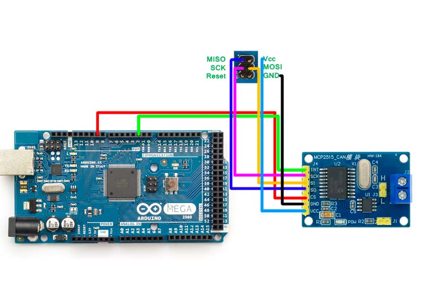

## MEGA_EPIC_CANBUS

Arduino Mega2560 firmware that expands epicEFI ECU I/O over CAN bus using an MCP2515-based shield. Provides 16 analog inputs, 14 PWM outputs, 15 digital inputs, and 15 digital outputs via the EPIC_CAN_BUS protocol at 500 kbps.

*Example hookup of the MCP2515 CAN shield to the Arduino Mega2560. Ensure your wiring matches this diagram, especially for SPI lines Interrupt (D2) and CS (D9).*

### Features
- **16 analog inputs**: A0–A15 (0–5V)
- **PWM outputs** (planned): D2–D8, D10–D13, D44–D46
- **digital button inputs**: D22–D37
- **digital low-speed outputs** (planned): D39–D43, D47–D49
- **CAN 500 kbps** via MCP2515 (CS on `D9`, SPI via ICSP header or D50–D53)
- **GPS input over Serial2**: NMEA‑0183 (`GPRMC`/`GPGGA`) parsed and sent to ECU over CAN
- EPIC protocol operations: variable request/response, variable set, function call

### Status
- Current:
  - CAN TX/RX implemented
  - Analog, digital, and VSS inputs sampled and transmitted using a smart on-change + heartbeat strategy
  - GPS (time, date, position, speed, course, altitude, quality, satellites) read from Serial2, packed, and transmitted to the ECU using the same smart TX pattern
- Missing: EPIC frame parsing, digital/PWM output modules, error handling

### Hardware
- Arduino Mega2560
- MCP2515‑based CAN shield (e.g. generic MCP_CAN shield)
- Default GPS module: GT‑U7 (u‑blox 7) style module  
  (e.g. [GT‑U7 (u‑blox7) module](https://www.amazon.com/dp/B08MZ2CBP7?ref_=ppx_hzsearch_conn_dt_b_fed_asin_title_13))

#### Wiring Notes (Important)
- **SPI / MCP2515:**
  - Use the **6‑pin ICSP header in the center of the Mega2560** for SPI (MISO/MOSI/SCK).  
    Many MCP2515 shields have a matching 2×3 header that should plug directly into the ICSP header.
  - `CS` (chip select) for MCP2515 is **D9** (reserved, do not use for other I/O).
  - The shield’s SPI pins **must** be routed to the ICSP header or to D50 (MISO), D51 (MOSI), D52 (SCK), D53 (SS) exactly as on a proper shield – avoid flying leads if possible.
- **CAN interrupt (optional but recommended):**
  - MCP2515 `INT` should be wired to **D2** on the Mega2560.
  - Firmware is written to support interrupt‑driven RX using D2 when available.
- **CAN bus:**
  - CAN_H/CAN_L twisted pair with proper 120Ω termination at both ends of the bus.

### Pin Map Summary
- **Analog inputs**: A0–A15
- **PWM outputs (planned)**: D2, D3, D5, D6, D7, D8, D11, D12, D44, D45, D46 (D9 used by CS)
- **Digital button inputs**: D22–D37 (16-bit packed, INPUT_PULLUP, inverted logic)
- **Digital low-speed outputs**: D39–D43, D47–D49
- **VSS inputs** (wheel speed):
  - D18: Front Left (INT3)
  - D19: Front Right (INT2)
  - D20: Rear Left (INT1, I2C SDA disabled)
  - D21: Rear Right (INT0, I2C SCL disabled)

### Protocol (EPIC_CAN_BUS)
- Base IDs (11-bit standard):
  - `0x700 + ecuCanId`: Variable request (DLC=4, int32 hash)
  - `0x720 + ecuCanId`: Variable response (hash + float32 value)
  - `0x740 + ecuCanId`: Function request (uint16 id, float32 arg1, optional int16 arg2)
  - `0x760 + ecuCanId`: Function response (uint16 id, return float32)
  - `0x780 + ecuCanId`: Variable set (hash + float32 value)
- Byte order: big-endian for all multi-byte fields

See `.project/epic_can_bus_spec.txt` for full details.

### Getting Started
1. Install Arduino IDE (1.8.x or 2.x)
2. Libraries:
   - `PWFusion_MCP2515` (Playing With Fusion MCP2515 library)
   - `SPI` (Arduino core)
3. Open `mega_epic_canbus.ino`
4. Board: Arduino Mega or Mega 2560 (ATmega2560)
5. Port: your USB serial port
6. Upload and open Serial Monitor at 115200 baud

### Configuration
- `ecuCanId` (0–15): per-device address used to derive CAN IDs (e.g., `0x700 + ecuCanId`). Define this in code and in docs. If not chosen, default to `1` in early testing.
- `CS` pin: **D9** (matches shield default and reserved in firmware)
- Optional interrupts: attach MCP2515 `INT` to **D2** to enable interrupt‑driven RX
- GPS:
  - Default baud rate: **115200** (tuned for GT‑U7 / u‑blox 7‑class modules that support 115200 and 20 Hz updates).
  - Default NMEA update rate: **20 Hz** (module must support this; slower 9600/1–5 Hz receivers can be used by lowering `GPS_BAUD_RATE` / `GPS_UPDATE_RATE_HZ` in code).

### Repository Structure
- `mega_epic_canbus.ino` — main sketch (setup, basic CAN RX demo)
- `variables.json` — pre-generated variable names and hashes for I/O mapping
- `.project/` — Memory Bank (project intent, architecture, specs)
  - `projectbrief.md` — identity, goals, architecture
  - `productContext.md` — problem/solution overview
  - `activeContext.md` — current work focus and next steps
  - `systemPatterns.md` — architecture, patterns, module plan
  - `techContext.md` — hardware/software constraints
  - `epic_can_bus_spec.txt` — protocol summary

### Roadmap
- Define and store `ecuCanId`
- Implement EPIC frame parsing and TX helpers
- Map variables from `variables.json` to pins (analogs, digital inputs)
- Implement analog input sampling and variable_set TX with throttling
- Implement digital input bitfield TX and output application
- Add PWM output control
- Enable interrupt-driven CAN RX
- Add watchdog and error handling

### Usage (planned behavior)
- Mega periodically samples A0–A15 and sends values as `variable_set` frames
- Digital inputs (D20–D34) packed into a bitfield and sent on change/interval
- ECU responses drive digital outputs (D35–D49) and PWM pins

### Performance Targets
- 500 kbps CAN
- 400–700 frames/sec practical throughput
- <10 ms latency for critical I/O updates

### Contributing
Issues and PRs welcome. Keep changes modular and avoid dynamic allocation on AVR. Reference the Memory Bank docs in `.project/` for architecture and constraints.

### License
TBD. If you intend to contribute a license, add a `LICENSE` file and update this section.

