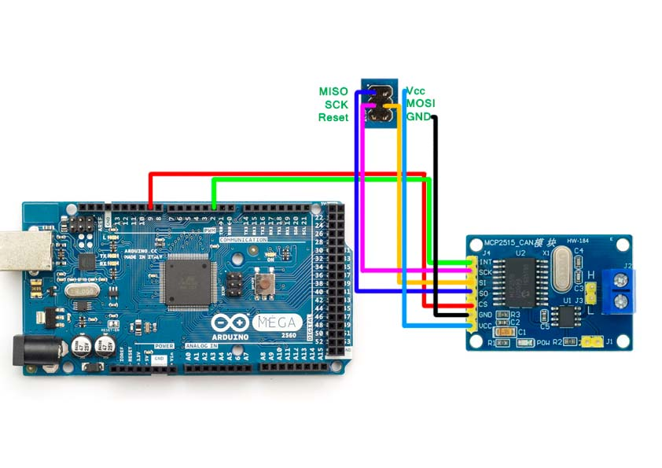

## MEGA_EPIC_CANBUS

Arduino Mega2560 firmware that expands epicEFI ECU I/O over CAN bus using an MCP2515-based shield. Provides 16 analog inputs, 11 PWM outputs (slow works now), 16 digital inputs, 7 digital outputs (slow works), and GPS input on TX2/RX2, all via the EPIC_CAN_BUS protocol at 500 kbps.

*Example hookup of the MCP2515 CAN shield to the Arduino Mega2560. Ensure your wiring matches this diagram, especially for SPI lines Interrupt (D2) and CS (D9).*

### Features
- **16 analog inputs**: A0–A15 (0–5V)
- **PWM outputs** (planned): D2–D8, D10–D13, D44–D46
- **digital button inputs**: D22–D37
- **digital low-speed outputs** (planned): D39–D43, D47–D49
- **CAN 500 kbps** via MCP2515 (CS on `D9`, SPI via ICSP header or D50–D53)
- **GPS input over Serial2**: NMEA‑0183 (`GPRMC`/`GPGGA`) parsed and sent to ECU over CAN
- EPIC protocol operations: variable request/response, variable set, function call

### Status
- Current:
  - CAN TX/RX implemented; the MCP2515 filters accept only the ECU's variable-response ID
  - Analog (A0–A15), digital (D22–D37) and VSS inputs sampled and transmitted using a smart on-change (25 ms) + heartbeat (500 ms) strategy
  - GPS (time, date, position, speed, course, altitude, quality, satellites) read from Serial2, packed, and transmitted to the ECU using the same smart TX pattern
  - **Slow outputs applied**: the ECU's unsolicited `MEGA_EPIC_1_OUT_SLOW` variable-response drives the 8 slow GPIO pins and the 10 PWM pins (on/off in v1); the sketch also polls that value every 25 ms as a backstop
- Missing: ECU-side function-call protocol (the ECU registry is not implemented), PWM duty granularity (bits are on/off only), watchdog and bus-error handling

### Hardware
- Arduino Mega2560
- MCP2515‑based CAN shield (e.g. generic MCP_CAN shield)
- Default GPS module: GT‑U7 (u‑blox 7) style module  
  (e.g. [GT‑U7 (u‑blox7) module](https://www.amazon.com/dp/B08MZ2CBP7?ref_=ppx_hzsearch_conn_dt_b_fed_asin_title_13))

#### Wiring Notes (Important)
- **SPI / MCP2515:**
  - Use the **6‑pin ICSP header in the center of the Mega2560** for SPI (MISO/MOSI/SCK).  
    Many MCP2515 shields have a matching 2×3 header that should plug directly into the ICSP header.
  - `CS` (chip select) for MCP2515 is **D9** (reserved, do not use for other I/O).
  - The shield’s SPI pins **must** be routed to the ICSP header or to D50 (MISO), D51 (MOSI), D52 (SCK), D53 (SS) exactly as on a proper shield – avoid flying leads if possible.
- **CAN bus:**
  - CAN_H/CAN_L twisted pair with proper 120Ω termination at both ends of the bus.

### Pin Map Summary
- **Analog inputs**: A0–A15
- **PWM outputs (planned)**: D2, D3, D5, D6, D7, D8, D11, D12, D44, D45, D46 (D9 used by CS)
- **Digital button inputs**: D22–D37 (16-bit packed, INPUT_PULLUP, inverted logic)
- **Digital low-speed outputs**: D39–D43, D47–D49
- **VSS inputs** (wheel speed):
  - D18: Front Left (INT3)
  - D19: Front Right (INT2)
  - D20: Rear Left (INT1, I2C SDA disabled)
  - D21: Rear Right (INT0, I2C SCL disabled)

### Protocol (EPIC_CAN_BUS)
- Base IDs (11-bit standard), per-ECU address `ecuCanId` (this sketch: `ECU_CAN_ID 1`, must match the ECU's `ecuCanId`):
  - `0x700 + id`: Variable request (DLC=4, int32 hash) — this sketch polls `MEGA_EPIC_1_OUT_SLOW` here every 25 ms
  - `0x720 + id`: Variable response (hash + float32 value) — the ECU answers polls here **and** broadcasts `MEGA_EPIC_1_OUT_SLOW` unsolicited on change
  - `0x740`/`0x760 + id`: Function request/response — documented, but **not implemented in the current epicEFI firmware** (the registry is commented out)
  - `0x780 + id`: Variable set — this sketch pushes every input here (hash + float32 value)
- Byte order: big-endian for all multi-byte fields

### Interaction with the epicEFI firmware

Full ECU-side contract (including gating and gotchas): `CLAUDE/mega_epic_canbus.md`
in the epicEFI firmware repo. Summary:

| Direction | ID | Hash / value | ECU side |
|---|---|---|---|
| Mega → ECU | `0x780+id` | `MEGA_EPIC_1_A0..A15` (raw 10-bit ADC counts 0–1023) | `MEGA_EPIC_1_A0..A15` OUTPC, selectable as `MEGA_EPIC_CANBUS_ADC_0..15` analog channels |
| Mega → ECU | `0x780+id` | `MEGA_EPIC_1_D22_D37` (bit0=D22…bit15=D37, grounded=1) | packed word + per-bit indicators; readable as `MEGA_EPIC_D22..D37` switch inputs |
| Mega → ECU | `0x780+id` | `canVSSFrontLeft/FrontRight/RearLeft/RearRight` (pulses/sec) | the four `canVSS*` output channels |
| Mega → ECU | `0x780+id` | packed GPS hashes `703958849` / `-1519914092` and the individual GPS floats | `gps_hours/minutes/seconds/days`, `gps_months/years/quality/satellites`, `gps_latitude` etc. |
| ECU → Mega | `0x720+id` | `MEGA_EPIC_1_OUT_SLOW` (1430780106), 18-bit packed | bits 0–7 slow GPIO D39–D43/D47–D49, bits 8–17 PWM D3/D5/D6/D7/D8/D11/D12/D44/D45/D46 |

ECU gates: `epicCanAllowSetVar` (external writes, **off by default**) and
`epicCanEcuReadONLYONWrite` (first accepted write sets the ECU read-only so the
change is not persisted). The ECU answers an unknown hash with **silence**, not
a zero — a zero-as-error frame would be indistinguishable from a genuine
`OUT_SLOW = 0` update on the same ID. The unsolicited `OUT_SLOW` broadcast is
throttled to the ECU's 20 ms CAN TX interval and can be disabled with
`disable_mega_epic_slow_out`.

See `.project/epic_can_bus_spec.txt` for the wire format and the historical
protocol notes.

### Getting Started
1. Install Arduino IDE (1.8.x or 2.x)
2. Libraries:
   - `arduino-mcp2515` (autowp MCP2515 CAN interface library)
   - `SPI` (Arduino core)
3. Open `mega_epic_canbus.ino`
4. Board: Arduino Mega or Mega 2560 (ATmega2560)
5. Port: your USB serial port
6. Upload and open Serial Monitor at 115200 baud

### Configuration
- `ecuCanId` (0–15): per-device address used to derive CAN IDs (e.g., `0x700 + ecuCanId`). Define this in code and in docs. If not chosen, default to `1` in early testing.
- `CS` pin: **D9** (matches shield default and reserved in firmware)
- GPS:
  - Default baud rate: **115200** (tuned for GT‑U7 / u‑blox 7‑class modules that support 115200 and 20 Hz updates).
  - Default NMEA update rate: **20 Hz** (module must support this; slower 9600/1–5 Hz receivers can be used by lowering `GPS_BAUD_RATE` / `GPS_UPDATE_RATE_HZ` in code).

### Repository Structure
- `mega_epic_canbus.ino` — main sketch (setup, basic CAN RX demo)
- `variables.json` — pre-generated variable names and hashes for I/O mapping
- `nmea_parser.h`, `nmea_parser.cpp` — NMEA GPS message parsing (for GPS input)
- `arduino-mcp2515-master/` — provided CAN bus library (autowp MCP2515, unzip and install as Arduino library)
- `.project/` — Memory Bank (project intent, architecture, specs)
  - `projectbrief.md` — identity, goals, architecture
  - `productContext.md` — problem/solution overview
  - `activeContext.md` — current work focus and next steps
  - `systemPatterns.md` — architecture, patterns, module plan
  - `techContext.md` — hardware/software constraints
  - `epic_can_bus_spec.txt` — protocol summary

### Roadmap
- Done: `ecuCanId` addressing, TX helpers, variable mapping (`variables.json`), smart TX, digital bitfield, slow/PWM output application, GPS and VSS inputs
- Open: ECU-side function-call protocol (blocked on the firmware registry), PWM duty values (v1 is on/off), interrupt-driven CAN RX, watchdog and bus-error handling

### Usage (actual behavior)
- A0–A15 sampled every 10 ms; `variable_set` on change (25 ms floor) and a 500 ms heartbeat
- D22–D37 packed (grounded = 1) and sent on change/heartbeat
- VSS D18–D21 counted by interrupt, pulses/sec sent on change/heartbeat
- The ECU's `MEGA_EPIC_1_OUT_SLOW` variable-response drives D39–D43/D47–D49 (digital) and D3/D5/D6/D7/D8/D11/D12/D44/D45/D46 (on/off)

### Performance Targets
- 500 kbps CAN
- 400–700 frames/sec practical throughput
- <10 ms latency for critical I/O updates

### Contributing
Issues and PRs welcome. Keep changes modular and avoid dynamic allocation on AVR. Reference the Memory Bank docs in `.project/` for architecture and constraints.

### License
TBD. If you intend to contribute a license, add a `LICENSE` file and update this section.

